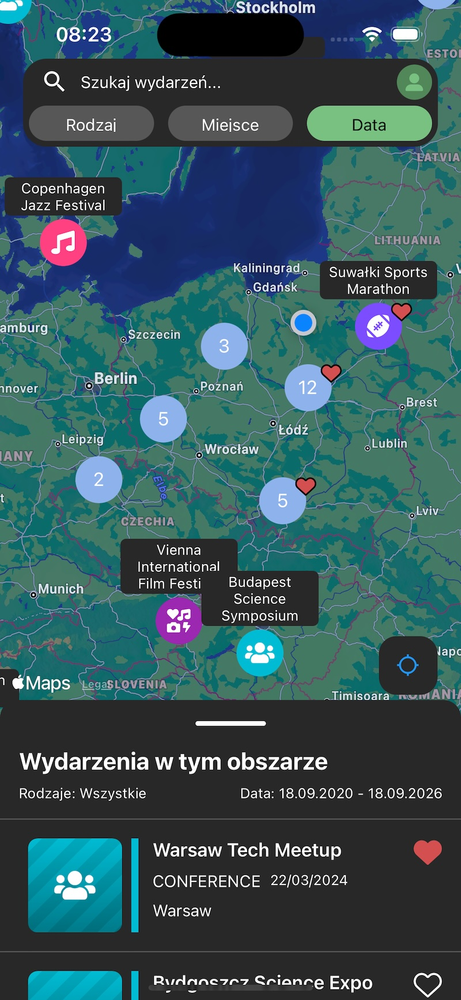
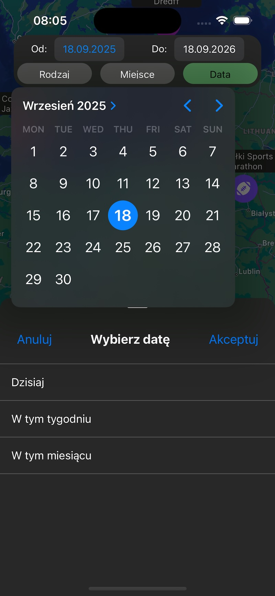
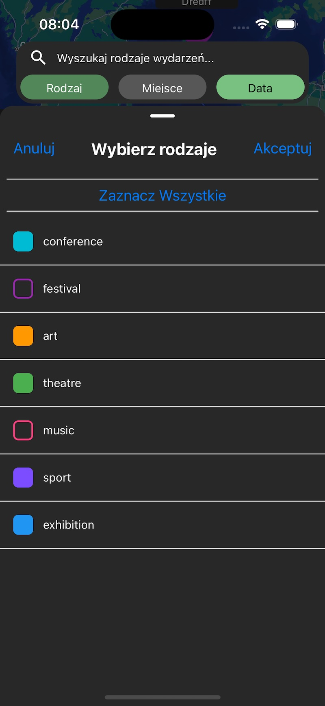
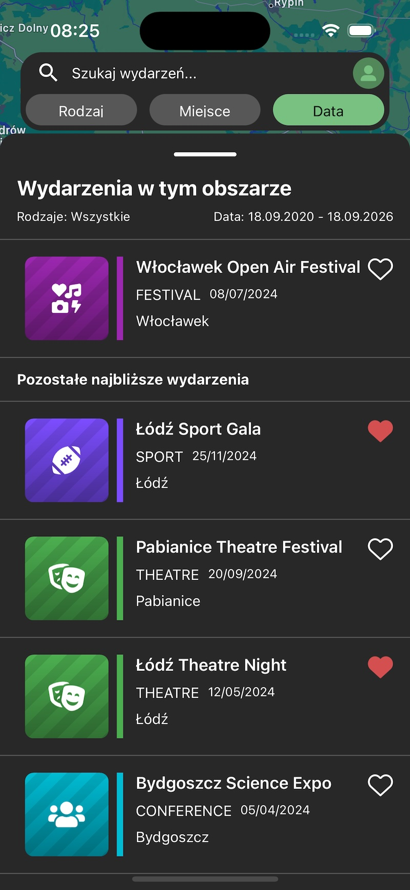

<<<<<<< HEAD
Hi! I'm building this app with ambition to show events in a interactive map format.

# Event Map App

Mobile application built with React Native for discovering cultural events on an interactive map.

    
    
    
    

---

## Overview

This project was designed to help users explore cultural events such as concerts, exhibitions, and meetups based on their location, helping them to plan trips.

The goal was to create a simple and intuitive way to:

-   browse events geographically
-   filter events by category and date
-   discover local culture in real time

Although the project was discontinued due to lack of external funding, it demonstrates my ability to design and build a real-world mobile application from concept to implementation.

---

## Tech Stack

-   React Native
-   TypeScript
-   Google Maps API
-   Supabase

---

## Features

-   📍 Interactive map with event markers
-   🔍 Filtering by category and date
-   📄 Event details screen
-   📱 Mobile-first, responsive UI
-   🌍 Location-based event discovery
-   👤 User authentication and profiles

---

## Key Focus Areas

While building this project, I focused on:

-   clean and scalable architecture
-   reusable and maintainable components
-   efficient state management
-   handling asynchronous data (API requests)
-   performance optimization for mobile devices
-   intuitive UX for map-based interactions

---

## Project Status

This project was discontinued after failing to secure external funding.

Despite that, it serves as a strong portfolio piece demonstrating:

-   building a production-like mobile application
-   working with geolocation and maps
-   designing scalable frontend architecture
-   translating product ideas into working software

---

## What I Would Improve

If I continued development, I would focus on:

-   real-time updates (e.g. WebSockets)
-   offline support
-   performance improvements for large datasets

---

## What I Learned

-   improved handling of asynchronous operations in mobile apps
-   gained experience with map-based UI challenges
-   learned how to structure scalable React Native projects
-   improved focus on mobile UX and performance

---

## Author

Created by Marek Pruszkowski

If you have any questions or feedback, feel free to reach out.
